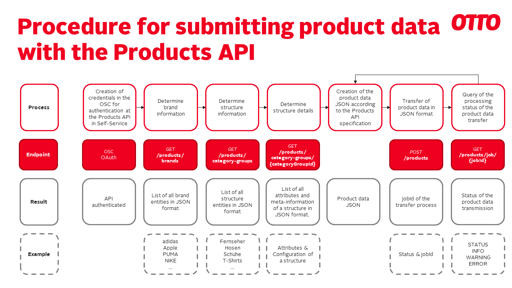

# OTTO Retail-API specifications

At the moment our API is in a beta version. This means that - although the API is already in a very advanced and stable state - there is still the possibility that different elements of the API might change (path, parameters, return objects etc.) as we are learning from the feedback of our early adaptors. We welcome explicitly early adaptors at this point.

### Scope

The API supports the submission of product data including prices, media assets and packing units in production.

### Known limitations

Please note that articles where you need to specify material composition such as textiles cannot be send via the API at this time as the API does not yet support the delivery of material compositions.

### Change Log

| *Date* | *Classification* | *Description* |
| ------ | ----------- |----------- |
| 2023-10-02 | Documentation | Update media asset requirements. |
| 2023-09-14 | Documentation | Update of error codes and levels, added media asset details. Updated yml. |
| 2023-07-12 | Documentation | Added example and error documentation |
| 2023-06-02 | Documentation | Intial Version of documentation |
| 2023-06-02 | New Version | Initial Version of the api has been released. |

## Implementing the products API

To implement the API you need to go through the following steps:

 - Obtain a sandbox client in the OTTO supplier connect
 - Implement the API using the sandbox client
 - Contact us via the Otto supplier connect helpdesk that you are ready to submit data in production in order to get production clearance
 - Obtain the production client in the OTTO supplier connect
 - Start submitting your product data

The YAML specification of the products API can be found [here](products-api.yml).

### Environments

We offer a sandbox and a production environment for our API. Please request a client for the sandbox environment and implement and test the API in the sandbox environment BEFORE requesting and using the API in the production environment. The client for the production environment will only be provided when you have successfully submitted data in the sandbox environment. More information about the different environments can be found [here](../01_getting-started/README.md).

The API as well as the metadata (brands, category groups, ..) that you can retrieve via the API endpoint is identical for both environments, however your submitted product data in the sandbox environments will be deleted after 30 days as this is used only for testing the API.

### Authentication

The information about the authentication can be found [here](../01_getting-started/01_authentication.md).

## Preparation of product data transfer

If you want to submit your product data, you will need to follow the following generic process:

 - Step 1: Retrieve the brand id of your product via the *brands* endpoint
 - Step 2: Retrieve the category group id for your product category group from the list of category groups via the *category-groups* endpoint. 
 - Step 3: Retrieve the details (list of category specific attributes) for your category group via the *category-groups* endpoint
 - Step 4: Submit your product data

The following image shows an overview of the process:

## Submitting product data

You can submit your data via the *products* endpoint using the brand id (retrieved via step 1), the category group id (retrieved via step 2) and providing the product data. The product data is composed out of *category specific* (list obtained via step 3) and *category overarching attributes* (can be found in the documentation of the *products* endpoint).

Please take into account that OTTO is using a two-stage model using products and variants.

When submitting your product data, you will retrieve a *jobId* together with the *processing status* of your data submission. 

You can then get the status ("in process" / "finished") and result of your upload via the *job* endpoint.

## Status of your data submission

The status of your data submission contains information about:

- The **jobId** of your data submission
- The number of so far **processed** products
- The **total** number of submitted products

Once the number of so far processed products equals the total number of submitted products, your data submission has been finished. Alternatively you can check if there is a product status left in "IN_PROGRESS" (see below).

## Result of your data submission

The result of your data submission as well as the processing details are given either on the product or variant level, depending on its origin.

### Product level

On the *product level* you can find the following information for the entire product:

The **status** of your submitted *product*: 

  | *Status* | *Description* | 
  | ------ | ----------- |
  | *IN_PROGRESS* | The data submission of the product is still in progress |
  | *ACCEPTED* | Your product has been accepted/updated in our system |
  | *PARTIALLY_ACCEPTED* | Some of the variants of your product have been accepted/updated but not all due to errors in these variants. Please refer to the result of the individual variants in order to find out which variants were not accepted and for which reasons. |
  | *NOT_ACCEPTED* | Your product (and all the related variants) has not been accepted due to errors. Please refer to the details of the product and variants in order to find out the reasons |

The **errors** and **warnings** for your submitted *product*.

- Each element is composed out of 
  - a *title* providing the description of the element
  - a *code* to identify the element
  - a list of *details* providing more details of the element (e.g. the affected attribute).
- Please see below for the list and explanation of the possible elements.
- All reported elements in the **errors** block lead to a rejection of the entire product. The product will not be created/updated at all.
- All reported elements in the **warnings** block lead to a rejection of the individual attribute or inform you about a not provided individual attribute which will not be set: The product will still be created/updated in general, however the individual attribute will not be set or - in case of an update - it will be reset.

### Variants level 

On the *variants level* you can find the following information for the individual variant:

The **status** of your submitted *product*:

| *Status* | *Description* | 
| ------ | ----------- |
| *IN_PROGRESS* | The data submission of the variant is still in progress |
| *ACCEPTED* | Your variant has been accepted/updated in our system |
| *NOT_ACCEPTED* | Your variant has not been accepted due to errors. Please refer to the details in order to find out the reasons |

The **errors** and **warnings** for your submitted *variant*:

- Each element is composed out of 
  - a *title* providing the description of the element
  - a *code* to identify the element
  - a list of *details* providing more details of the element (e.g. the affected attribute).
- Please see below for the list and explanation of the possible elements.
- All elements in the **errors** block lead to a rejection of the entire variant
- All reported elements in the **warnings** block lead to a rejection of the individual attribute or inform you about a not provided individual attribute which will not be set: The product will still be created/updated in general, however the individual attribute will not be set or - in case of an update - it will be reset.

In case of errors or warnings, you can resubmit your data after correcting the errors and warnings.

## Updating your data

You can update your product data via the products endpoint in the same way as you submit the data on creation of your products/variants.

Please take into account the following guidelines when updating your products:

- The API only supports *full updates*. This means that you always will have to provide the full set of product data for your variant. If you do not specify a product data value in an update, this product data value will be reset for a succesful update. If the update is not succesful, the value will be untouched.

- If you want to update data located on a *product level*, you will always need to submit all variants of the product as the product has to be updated as a unit in this case. Failing to do so will result in an error and a rejection of the data submission. If you only want to update data located on a variant level, you can submit individual variants without problems.

- If you want to update data located on a *product level*, you will always need to submit the entire product (with all variants) in one call. Failing to do so will be interpreted as a partial product update and result in an error and a rejection of the data submission.

## Example

You can find a working example of a product submission JSON [here](api-samples.md).

## Error handling

The list of errors and warnings that are given by the API can be found [here](api-error-codes.md).

## Media assets

The constraints of the media assets can be found [here](api-multimedia-assets.md).
