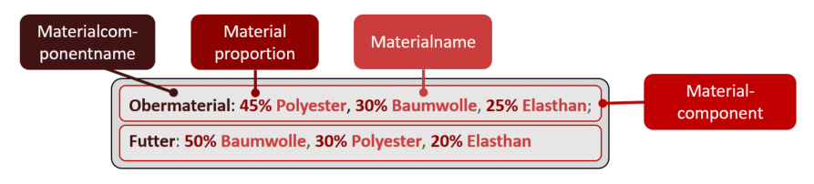

# Material composition

The material composition is specified in the material composition field "Materialzusammensetzung".

The base for the material composition is the currently valid textile conventions of the EU. The material composition must be transferred in the following format (please note the structure, blank and separator characters):

The list of valid material names can be found [here](material-names.md).

The list of valid material component names can be found [here](material-component-names.md).

Specifically, the following guidelines and syntax rules, among others, apply to the specification of the material composition:

| Rule                                               | Definition                                                                                                                                                                                                                                             | Examples                                                                                               | 
|----------------------------------------------------|--------------------------------------------------------------------------------------------------------------------------------------------------------------------------------------------------------------------------------------------------------|--------------------------------------------------------------------------------------------------------|
| **Material proportion**                            | You must specify for each material the percentage proportion as an integer by specifying the corresponding percentage value directly followed by a percent sign ("%").                                                                                 | ") 70% Baumwolle, 30% Viskose                                                       |
|                                                    |                                                                                                                                                                                                                                                        | ") Baumwolle, Viskose                                                   |
|                                                    |                                                                                                                                                                                                                                                        | ") 70 Baumwolle, 30  Viskose                                            |
|                                                    |                                                                                                                                                                                                                                                        | ") 70 %Baumwolle, 30 % Viskose                                          |
|                                                    |                                                                                                                                                                                                                                                        | ") 70,2345% Baumwolle, 30 % Viskose                                     |
| **Material name**                                  | For the (base) material names, one of the valid names from the (base) material name list must be used. The list can be found [here](material-names.md).                                                                                                | ") 70% Baumwolle, 30% Viskose                                                       |
|                                                    | Abbreviations, codes and alternative spellings are not permitted.                                                                                                                                                                                      | ") 70% Baumwollstoff, 30% Visk.                                         |
|                                                    |                                                                                                                                                                                                                                                        | ") 70% CO, 30% VISKOSE                                                  | 
| **Brand fibers**                                   | Brand fibers can be appended to the corresponding (base-) material name in parentheses separated by a space. Only the permitted names/brand names combinations of names may be used. (see the list of valid material names [here](material-names.md)). | ") 100% Viskose (LenzingTM)                                              |
|                                                    |                                                                                                                                                                                                                                                        | ") 100% Viskose Lenzing  TM                                  |
|                                                    |                                                                                                                                                                                                                                                        | ") 100% Viskose aus LenzingTM                                | 
|                                                    |                                                                                                                                                                                                                                                        | ") 100% Viskose-LenzingTM                                    | 
| **Comma separated material list**                  | If more than one material exists, all materials must be specified separately by a comma (",").                                                                                                                                                         | ") 70% Baumwolle, 30% Viskose                                                       |
|                                                    |                                                                                                                                                                                                                                                        | ") 70% Baumwolle 30% Viskose                                            |  
|                                                    |                                                                                                                                                                                                                                                        | ") 70% Baumwolle; 30% Viskose                                           | 
| **Complete material specification**                | The sum of all materials for a material component must be 100%.                                                                                                                                                                                        | ") 70% Baumwolle, 30% Viskose                                                       | 
|                                                    |                                                                                                                                                                                                                                                        | ") 70% Baumwolle, 20% Viskose                                           | 
| **Other fibers**                                   | If not all materials are specified, a maximum of 15% "sonstige Fasern" (other fibers) may be specified as material.                                                                                                                                    | ") 60% Hanf, 30% Viskose, 10% sonstige Fasern                                       |
|                                                    |                                                                                                                                                                                                                                                        | ") 80% Hanf, 20% sonstige Fasern                                        | 
| **Material component names**                       | If only one material component is specified, the material component name can be omitted.                                                                                                                                                               | ") 60% Hanf, 40% Viskose                                                            |
|                                                    |                                                                                                                                                                                                                                                        | ") Obermaterial: 60% Hanf, 40% Viskose                                              
|                                                    | If more than one material component is specified, each material component must be given a material component name.                                                                                                                                     | ") Obermaterial: 60% Hanf, 40% Viskose; Futter: 100% Baumwolle                      |
|                                                    |                                                                                                                                                                                                                                                        | ") 60% Hanf, 40% Viskose; 100% Baumwolle                                |  
|                                                    |                                                                                                                                                                                                                                                        | ") Obermaterial: 60% Hanf, 40% Viskose; 100% Baumwolle                  |
|                                                    | The material component name is specified before the respective material list and is terminated by a colon (":") and a space.                                                                                                                           | ")Obermaterial: 60% Hanf, 40% Viskose                                               |
|                                                    |                                                                                                                                                                                                                                                        | ") Obermaterial 60% Hanf, 40% Viskose                                   |
|                                                    |                                                                                                                                                                                                                                                        | ") Obermaterial - 60% Hanf, 40% Viskose                                 |
|                                                    |                                                                                                                                                                                                                                                        | ") 60% Hanf, 40% Viskose (Obermaterial)                                 |
|                                                    | Only names from the list of valid material component names may be used.                                                                                                                                                                                | ") Obermaterialstoff: 60% Hanf, 40% Viskose                             |
| **Products with more than one material component** | If more than one material component exists, all material components must be specified.                                                                                                                                                                 | ") Obermaterial: 60% Baumwolle, 40% Viskose; Futter: 100% Baumwolle                 |
|                                                    | The material components must be listed separated by a semicolon (";") and spaces.                                                                                                                                                                      | ") Obermaterial: 60% Baumwolle, 40% Viskose Futter: 100% Baumwolle      | 
|                                                    |                                                                                                                                                                                                                                                        | ") Obermaterial: 60% Baumwolle, 40% Viskose / Futter: 100% Baumwolle    | 
|                                                    | The last material component may not have a closing semicolon.                                                                                                                                                                                          | ") Obermaterial: 60% Baumwolle, 40% Viskose; Futter: 100% Baumwolle;    |                                                                                                         
|                                                    | Each material component must have a unique material component name, duplications are not allowed.                                                                                                                                                      | ") Obermaterial: 60% Baumwolle, 40% Viskose; 100% Baumwolle |
|                                                    |                                                                                                                                                                                                                                                        | ") Obermaterial: 60% Baumwolle, 40% Viskose; Obermaterial: 100% Baumwolle |

If you are missing entries in the tables of valid (base) material names, brand fibers and material component names, please contact us via the ticket system of the Otto Supplier Connect (OSC) portal.